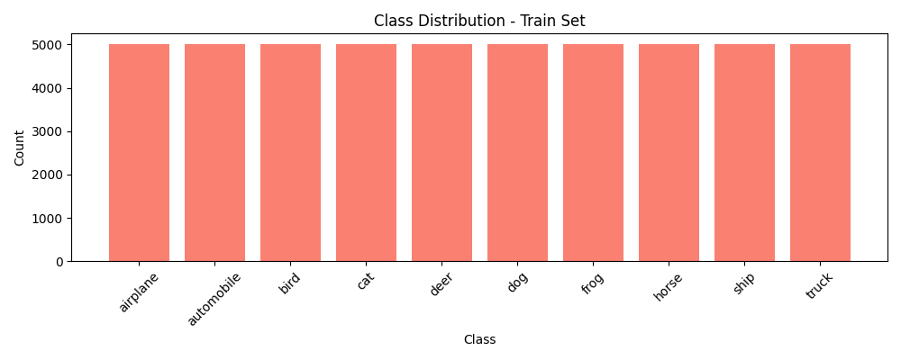
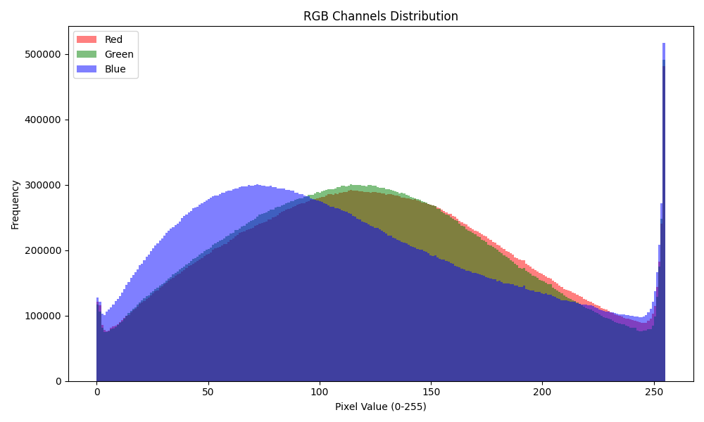
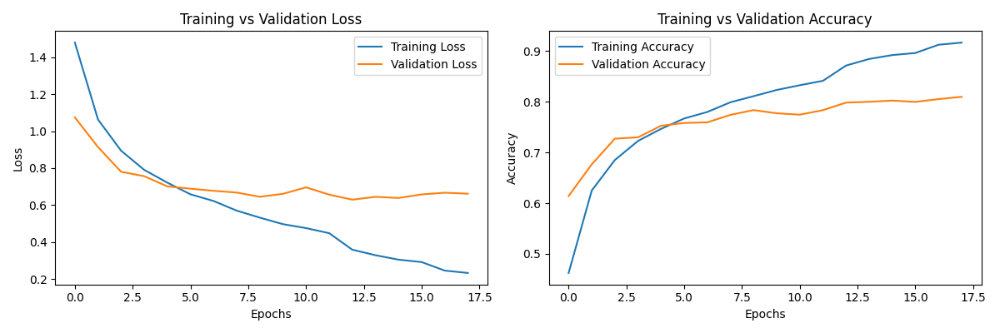
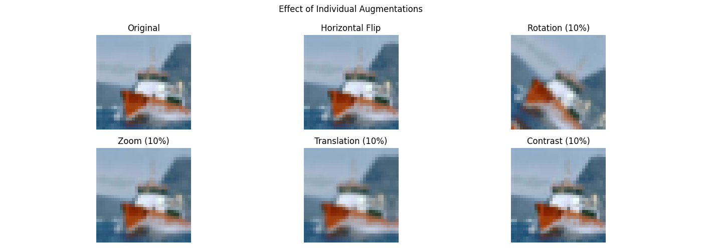
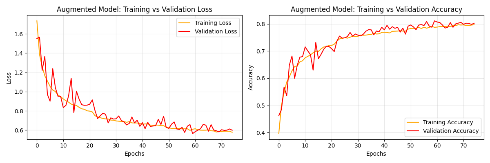
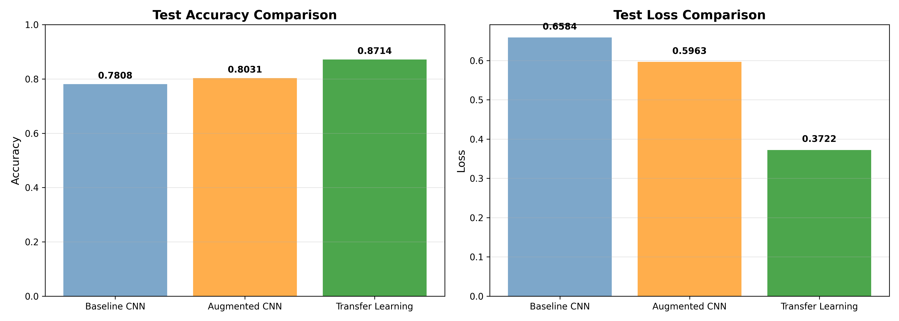
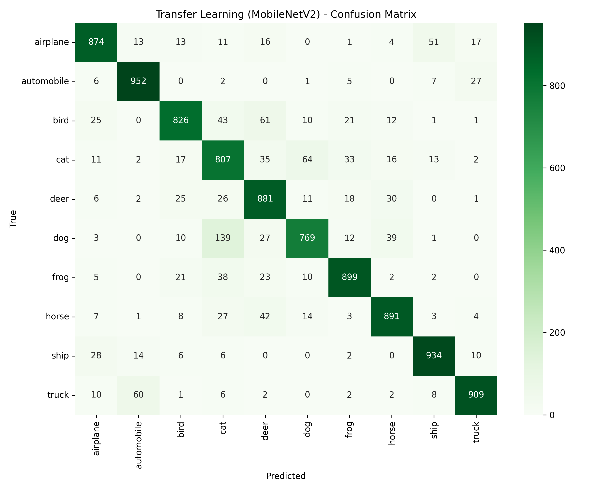

# CIFAR-10 Image Classification with CNN

Deep learning image classification comparing three architectures: Baseline CNN, Augmented CNN with BatchNorm, and Transfer Learning with MobileNetV2. Production-ready with FastAPI and Docker.

## Project Highlights

- **87.4% accuracy** with Transfer Learning (MobileNetV2)
- **3-model progressive comparison** demonstrating iterative improvement
- **Overfitting analysis** with mitigation strategies (augmentation, regularization)
- **Production-ready REST API** with single and batch prediction endpoints
- **Docker containerization** for scalable deployment

---

## Dataset

**CIFAR-10**: 60,000 color images (32x32 RGB) across 10 classes.

| Split | Images | Classes |
|-------|--------|---------|
| Train | 40,000 | 10 |
| Validation | 10,000 | 10 |
| Test | 10,000 | 10 |

**Classes**: airplane, automobile, bird, cat, deer, dog, frog, horse, ship, truck

---

## Exploratory Data Analysis

### Sample Images per Class


### Class Distribution


Balanced dataset with 5,000 training images per class.

### RGB Channel Analysis


Channel statistics (0-255 range):
- Red: mean=125.31, std=62.99
- Green: mean=122.95, std=62.09
- Blue: mean=113.87, std=66.70

---

## Model Architectures

### 1. Baseline CNN

Custom CNN with 2 convolutional blocks:

```
Conv2D(32) → Conv2D(32) → MaxPool → Dropout(0.25)
Conv2D(64) → Conv2D(64) → MaxPool → Dropout(0.25)
Flatten → Dense(512) → Dropout(0.5) → Dense(10, softmax)
```

**Parameters**: 2.1M trainable



**Result**: 78.66% accuracy | 4.45% overfitting gap

---

### 2. Augmented CNN + BatchNorm

Same architecture with data augmentation and batch normalization:



**Augmentation pipeline**:
- RandomFlip (horizontal)
- RandomRotation (10%)
- RandomZoom (10%)
- RandomTranslation (10%)
- RandomContrast (10%)



**Result**: 80.57% accuracy | 0.55% overfitting gap

*Augmentation eliminated overfitting but modest accuracy gain.*

---

### 3. Transfer Learning (MobileNetV2)

Pre-trained MobileNetV2 (ImageNet) as feature extractor:

```
Input(96x96x3) → MobileNetV2(frozen) → GlobalAvgPool
→ Dropout(0.5) → Dense(128) → Dropout(0.3) → Dense(10, softmax)
```

**Parameters**: 2.4M total (165K trainable)

Images resized from 32x32 to 96x96 for MobileNetV2 compatibility.

**Result**: 87.42% accuracy | 0.89% overfitting gap

---

## Results Comparison



| Model | Test Accuracy | Test Loss | Overfitting Gap |
|-------|---------------|-----------|-----------------|
| Baseline CNN | 78.66% | 0.657 | 4.45% |
| Augmented CNN | 80.57% | 0.577 | 0.55% |
| **Transfer Learning** | **87.42%** | **0.369** | **0.89%** |

**Key insight**: Transfer Learning achieves +8.76% accuracy over baseline while maintaining low overfitting, demonstrating the power of pre-trained features.

---

## Model Evaluation

### Confusion Matrix (Transfer Learning)


**Per-class performance** (F1-scores):
- Best: frog (0.93), ship (0.92), automobile (0.92)
- Challenging: cat (0.79), dog (0.82) — visually similar classes

---

## API Deployment

### Endpoints

| Method | Endpoint | Description |
|--------|----------|-------------|
| GET | `/` | Health check |
| GET | `/health` | Detailed status |
| POST | `/predict` | Single image classification |
| POST | `/predict/batch` | Batch prediction (max 32) |

### Usage Example

```bash
# Single prediction
curl -X POST "http://localhost:8000/predict" \
  -F "file=@test_images/cat_test.png"

# Response
{
  "predicted_class": "cat",
  "confidence": 0.847,
  "probabilities": {"airplane": 0.02, "cat": 0.847, ...}
}
```

### Docker Deployment

```bash
# Build
docker build -t cifar10-api .

# Run
docker run -p 8000:8000 cifar10-api
```

---

## Tech Stack

| Category | Technologies |
|----------|--------------|
| Deep Learning | TensorFlow 2.20, Keras, MobileNetV2 |
| Data Processing | NumPy, Pandas, Pillow |
| Visualization | Matplotlib, Seaborn |
| API | FastAPI, Pydantic, Uvicorn |
| Deployment | Docker |
| ML Utilities | scikit-learn |

---

## Project Structure

```
CNN_image_classifier/
├── cnn_cifar10.ipynb          # Training notebook (EDA, models, evaluation)
├── app.py                      # FastAPI application
├── Dockerfile                  # Container configuration
├── models/
│   ├── best_transfer_mobilenet.keras   # Production model
│   ├── best_augmented.keras
│   ├── best_baseline.keras
│   └── classes.json            # Class mappings
├── figures/                    # All visualizations
├── test_images/                # Sample images for testing
└── requirements.txt
```

---

## Quick Start

```bash
# Clone and setup
git clone <repo-url>
cd CNN_image_classifier
python -m venv venv && source venv/bin/activate
pip install -r requirements.txt

# Run API
python app.py
# or with Docker
docker build -t cifar10-api . && docker run -p 8000:8000 cifar10-api
```

API available at `http://localhost:8000/docs` (Swagger UI)
