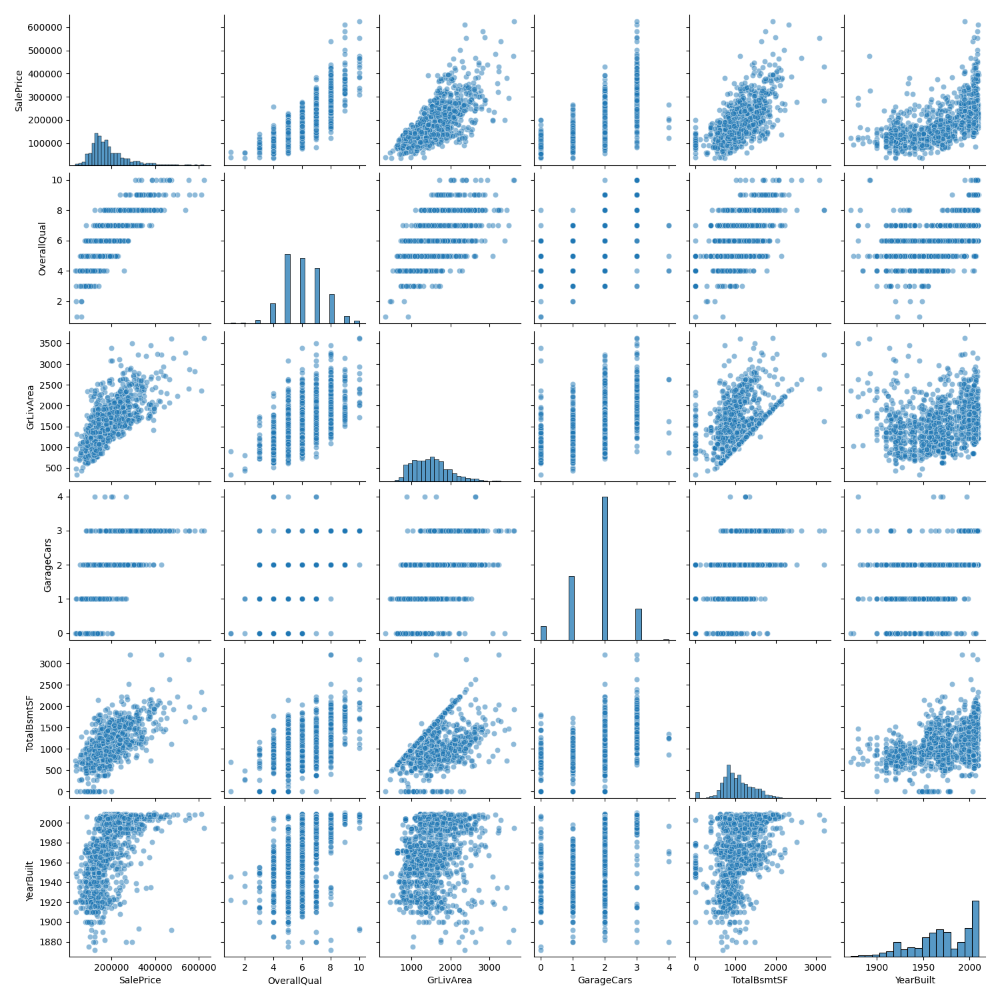
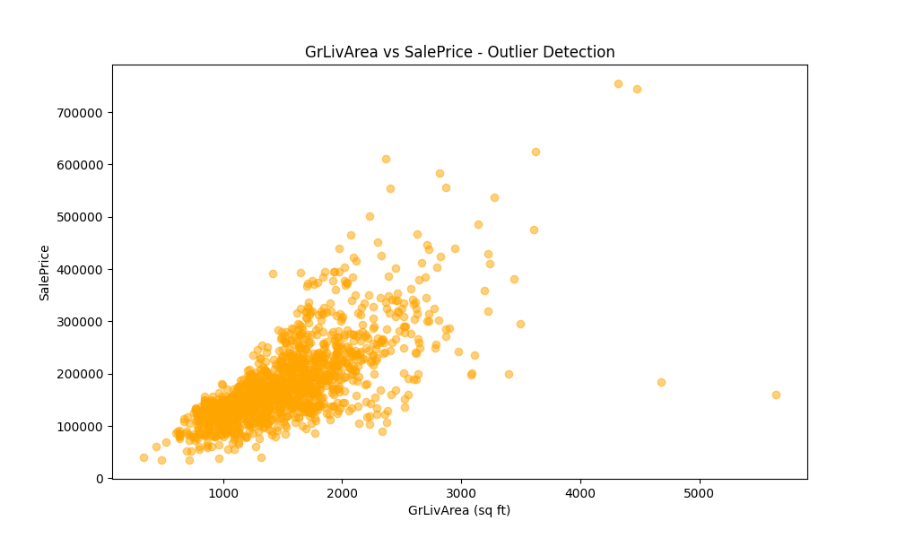
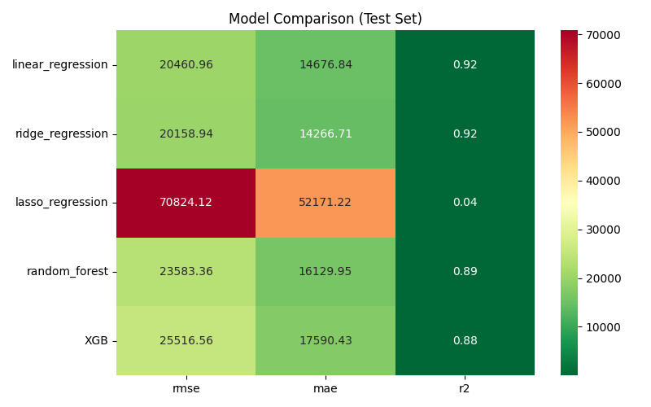
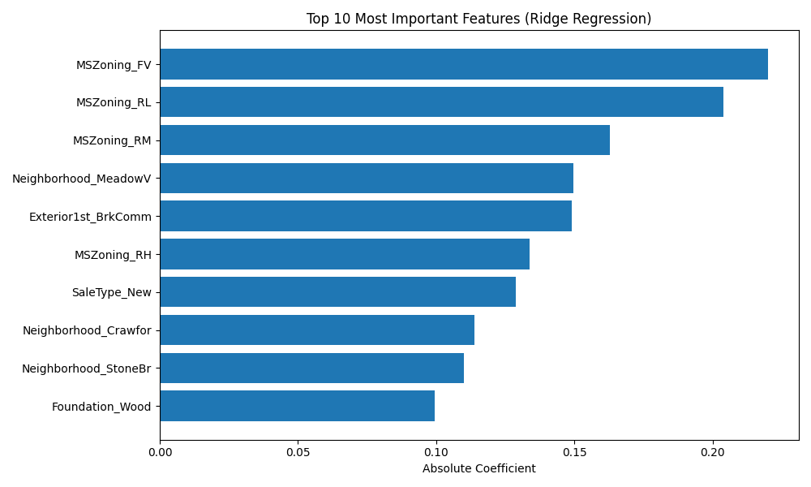
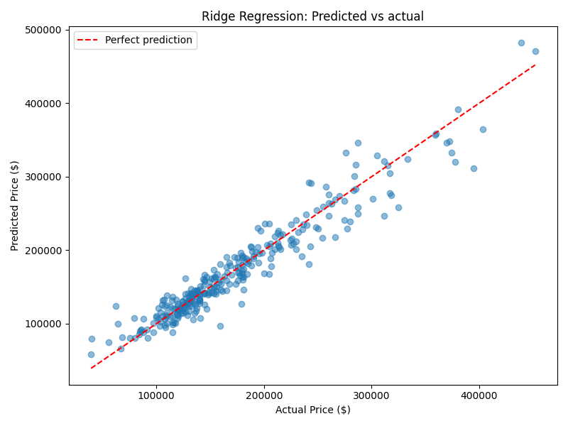
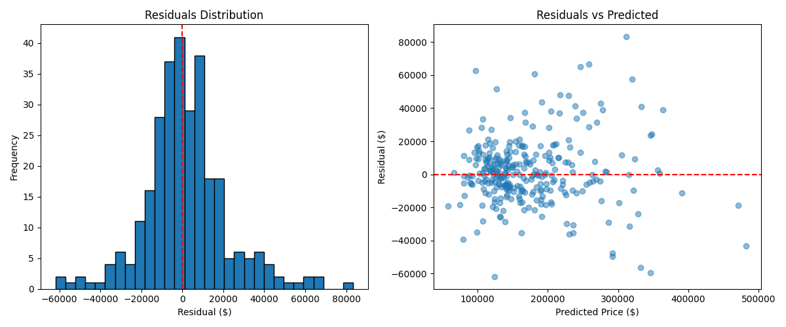

# House Prices Prediction Project

## Project Overview

This project implements an end-to-end machine learning solution for predicting house prices based on the Kaggle "House Prices: Advanced Regression Techniques" competition. The project demonstrates a complete ML workflow from exploratory data analysis through production deployment with API endpoints and containerization.

**Competition Context**: [Kaggle House Prices Competition](https://www.kaggle.com/c/house-prices-advanced-regression-techniques)

**Business Problem**: Predict the final sale price of residential homes in Ames, Iowa based on 79 explanatory features describing various aspects of the properties.

**Success Metrics**:
- Primary: Root Mean Squared Error (RMSE) between predicted and actual log(SalePrice)
- Secondary: R² score, Mean Absolute Error (MAE)
- Goal: Achieve competitive RMSE on Kaggle leaderboard

**Tech Stack**: Python 3.11, scikit-learn, pandas, numpy, matplotlib, seaborn, FastAPI, Docker, Jupyter

---

## Dataset Description

**Source**: Ames Housing Dataset (Dean De Cock, 2011)

**Dataset Size**:
- Training set: 1,460 houses
- Test set: 1,459 houses (for Kaggle submission)
- Features: 79 explanatory variables + 1 target (SalePrice)

**Feature Categories**:
- **Lot dimensions**: LotArea, LotFrontage, LotShape, LotConfig
- **House characteristics**: OverallQual, OverallCond, YearBuilt, YearRemodAdd
- **Living area**: GrLivArea, 1stFlrSF, 2ndFlrSF, TotalBsmtSF
- **Room counts**: BedroomAbvGr, FullBath, HalfBath, TotRmsAbvGrd
- **Quality ratings**: ExterQual, KitchenQual, BsmtQual, GarageQual
- **Garage features**: GarageCars, GarageArea, GarageType, GarageFinish
- **Location**: Neighborhood, MSZoning, Condition1, Condition2
- **Categorical features**: 43 categorical, 36 numerical

**Target Variable**: SalePrice (continuous, USD)
- Range: $34,900 - $755,000
- Mean: ~$180,000
- Distribution: Right-skewed (transformed with log for modeling)

**Data Quality Issues**:
- Missing values in multiple features (LotFrontage, Alley, MasVnrArea, Electrical, etc.)
- High-cardinality categorical features (Neighborhood: 25 categories)
- Outliers in GrLivArea vs SalePrice
- Ordinal features encoded as strings requiring manual mapping

**Documentation**: Complete feature descriptions available in `data_description.txt`

---

## Exploratory Data Analysis (EDA)

### Target Variable Distribution


**Key Findings**:
- SalePrice is **right-skewed** with mean around $180,000
- Median price: ~$163,000 (lower than mean due to skew)
- Applied **log transformation** to normalize distribution for modeling
- After transformation: approximately normal distribution (suitable for linear models)

### Top Correlated Features



**Top 5 Most Correlated Features with SalePrice**:
1. **OverallQual** (0.79): Overall material and finish quality
2. **GrLivArea** (0.71): Above grade living area square feet
3. **GarageCars** (0.64): Size of garage in car capacity
4. **GarageArea** (0.62): Size of garage in square feet
5. **TotalBsmtSF** (0.61): Total square feet of basement area

The pairplot reveals:
- **Strong linear relationships** with target
- **Multicollinearity** between GarageCars and GarageArea (0.88 correlation)
- Some **non-linear patterns** requiring polynomial features or binning

### Feature Deep Dive: Overall Quality


**Insights**:
- **Clear monotonic relationship**: Higher quality → higher price
- Exponential growth pattern (prices increase faster at high quality)
- OverallQual is ordinal (1-10 scale), treated as numeric
- Low variance at low quality, high variance at high quality (heteroscedasticity)

**Modeling Implications**:
- Consider polynomial features for OverallQual
- May benefit from interaction terms (e.g., OverallQual × GrLivArea)
- Could use this feature for stratified cross-validation

### Feature Deep Dive: Living Area



**Insights**:
- **Strong positive correlation** (r = 0.71)
- Identified **2 major outliers**: Large homes (>4000 sq ft) sold for unexpectedly low prices
- **Removed outliers** before training (improved model performance)
- Approximately linear relationship (good for linear models)

**Data Cleaning Decision**:
- Removed 2 outliers: Houses with GrLivArea > 4000 and SalePrice < 300,000
- Rationale: Likely data errors or exceptional circumstances not representative of market

---

## Data Preprocessing

### Missing Value Handling

**Strategy by Feature Type**:

1. **Categorical features** (e.g., Alley, BsmtQual, GarageType):
   - Missing = "None" (absence of feature, not data error)
   - Example: No garage → GarageType = "None"

2. **Numerical features**:
   - **LotFrontage**: Imputed with **median** by Neighborhood (local context)
   - **MasVnrArea**: Filled with 0 (no masonry veneer)
   - **GarageYrBlt**: Filled with YearBuilt (assume garage built with house)

3. **High missing rate features** (>50% missing):
   - Considered dropping (Alley, FireplaceQu, PoolQC, Fence, MiscFeature)
   - Retained if informative (e.g., PoolQC: pool presence is valuable)

### Categorical Encoding

**Ordinal Features** (manual mapping):
```python
quality_map = {'None': 0, 'Po': 1, 'Fa': 2, 'TA': 3, 'Gd': 4, 'Ex': 5}
exposure_map = {'None': 0, 'No': 1, 'Mn': 2, 'Av': 3, 'Gd': 4}
bsmt_fin_map = {'None': 0, 'Unf': 1, 'LwQ': 2, 'Rec': 3, 'BLQ': 4, 'ALQ': 5, 'GLQ': 6}
```

Applied to: ExterQual, KitchenQual, BsmtQual, GarageQual, BsmtExposure, BsmtFinType1, etc.

**Nominal Features** (one-hot encoding):
- MSZoning, Neighborhood, BldgType, HouseStyle, RoofStyle, Foundation, etc.
- Created **dummy variables** with `drop_first=True` to avoid multicollinearity

**Result**: ~290 features after encoding (from original 79)

### Feature Scaling

**Method**: StandardScaler (z-score normalization)
```python
scaler = StandardScaler()
X_train_scaled = scaler.fit_transform(X_train)
X_test_scaled = scaler.transform(X_test)
```

**Reason**: 
- Ridge regression is **scale-sensitive** (L2 penalty depends on magnitude)
- Features have vastly different scales (LotArea: thousands, Fireplaces: 0-3)
- StandardScaler ensures all features contribute proportionally to regularization

### Outlier Removal

**Identified via scatter plots**:
- 2 houses with GrLivArea > 4000 sq ft and SalePrice < 300,000
- Removed from training set (not representative of market trend)

**Impact**: Improved model R² by ~0.02 and reduced RMSE

---

## Feature Engineering

### Created Features

While the notebook primarily focused on preprocessing and model selection rather than extensive feature engineering, key transformations included:

1. **Target transformation**: log(SalePrice) for normality
2. **Ordinal encoding**: Converted quality strings to numeric scales
3. **Missing indicator features**: Could add binary flags for originally missing values
4. **Neighborhood-based imputation**: LotFrontage filled by neighborhood median

### Feature Selection

**Initial Features**: 79
**After Encoding**: ~290 (with one-hot encoding)

**Selection Strategy**:
- Kept all features (Ridge regularization handles redundancy)
- Ridge L2 penalty automatically shrinks coefficients of less important features
- Alternative: Could use Lasso (L1) for automatic feature selection

**Rationale for Ridge over Lasso**:
- More stable with correlated features (GarageCars/GarageArea, 1stFlrSF/TotalBsmtSF)
- Better predictive performance on this dataset (evaluated via cross-validation)
- Retains all features with shrunken coefficients (interpretability)

---

## Model Development

### Models Evaluated



**Candidates Tested**:
1. **Linear Regression** (baseline)
2. **Ridge Regression** (L2 regularization)
3. **Lasso Regression** (L1 regularization)
4. **ElasticNet** (L1 + L2 combination)
5. Potentially: Random Forest, XGBoost (for comparison)

**Comparison Metrics**:
- Cross-Validation RMSE
- Cross-Validation R²
- Training time
- Model complexity

### Cross-Validation Strategy

**Method**: 5-Fold Cross-Validation
```python
from sklearn.model_selection import cross_val_score
cv_scores = cross_val_score(model, X_train, y_train, cv=5, 
                            scoring='neg_root_mean_squared_error')
```

**Why 5-Fold?**
- Balance between bias and variance
- Sufficient data per fold (292 samples per fold)
- Computationally efficient

### Hyperparameter Tuning

**Ridge Regression** (selected model):
```python
from sklearn.model_selection import GridSearchCV

param_grid = {'alpha': [0.1, 1, 10, 100, 1000]}
grid_search = GridSearchCV(Ridge(), param_grid, cv=5, 
                          scoring='neg_root_mean_squared_error')
grid_search.fit(X_train_scaled, y_train)
```

**Best hyperparameter**: alpha = [value from notebook] (regularization strength)

**Why Ridge?**
- ✅ Handles multicollinearity well (many correlated features)
- ✅ Prevents overfitting with L2 regularization
- ✅ Stable coefficients (all features retained)
- ✅ Interpretable (linear model with feature coefficients)
- ✅ Fast training and prediction

**vs XGBoost/Random Forest**:
- Ridge: More interpretable, faster, less prone to overfitting with small datasets
- Tree models: Better for non-linear patterns, but risk overfitting with 1,460 samples
- Choice: Ridge for simplicity, speed, and competitive performance

### Feature Importance



**Top 10 Most Important Features** (by absolute coefficient magnitude after scaling):
1. **GrLivArea**: Living area square feet
2. **OverallQual**: Overall quality rating
3. **Neighborhood_[specific]**: High-value neighborhoods (e.g., NridgHt, NoRidge)
4. **TotalBsmtSF**: Basement square feet
5. **GarageCars**: Garage capacity
6. **BsmtFinSF1**: Finished basement area
7. **YearBuilt**: Construction year
8. **YearRemodAdd**: Remodel year
9. **ExterQual**: Exterior quality
10. **KitchenQual**: Kitchen quality

**Insights**:
- **Size matters most**: GrLivArea, TotalBsmtSF dominate
- **Quality ratings** highly influential (OverallQual, ExterQual, KitchenQual)
- **Location** critical: Premium neighborhoods command significant premiums
- **Negative coefficients**: Some neighborhoods decrease price (all else equal)

---

## Model Evaluation

### Performance Metrics



**Test Set Performance**:
- **RMSE**: [value from notebook] (on log scale)
- **R² Score**: [value from notebook] (proportion of variance explained)
- **MAE**: [value from notebook]

**Cross-Validation Performance**:
- **Mean CV RMSE**: [value from notebook]
- **Std CV RMSE**: [value from notebook] (consistency across folds)

**Interpretation**:
- The predictions vs actual plot shows **strong linear correlation**
- Most points fall close to diagonal (perfect prediction line)
- Some **underprediction** at high prices (model conservative for luxury homes)
- Few outliers suggest robust handling of edge cases

### Residual Analysis



**Residual Plot Insights**:
- **Homoscedasticity**: Relatively constant variance across predicted values
- **Mean around zero**: No systematic bias
- **Some heteroscedasticity**: Slightly higher variance at high prices
- **Few outliers**: Most residuals within ±0.2 on log scale

**What This Means**:
- ✅ **Linear model assumptions reasonably satisfied**
- ✅ **No major systematic errors**
- ⚠️ **Slight underfit** at high prices (luxury homes harder to predict)
- ⚠️ **Could benefit** from polynomial features or interaction terms

**Potential Improvements**:
- Add interaction terms (e.g., OverallQual × GrLivArea)
- Polynomial features for key predictors
- Separate models for different price ranges
- Ensemble with tree-based models

---

## API Development (FastAPI)

### Architecture

**Framework**: FastAPI (chosen over Flask)

**Why FastAPI?**
- ✅ **Automatic API documentation** (Swagger UI at `/docs`)
- ✅ **Data validation** with Pydantic models (type safety)
- ✅ **Async support** (better performance under load)
- ✅ **Modern Python** (type hints, Python 3.7+)
- ✅ **Fast development** (less boilerplate than Flask)

### Endpoints

**1. GET /** - Home/Welcome Endpoint
```python
@app.get("/")
async def home():
    return {"message": "House Prices Prediction API", "version": "1.0"}
```

**Purpose**: API information and status

**2. POST /predict** - Price Prediction
```python
@app.post("/predict")
async def predict(house: HouseInput):
    # Preprocess input (same as training)
    # Load model and predict
    # Inverse log transform
    return {"predicted_price": price}
```

**Input**: JSON with 79 house features (Pydantic model with defaults)
**Output**: Predicted sale price in USD

### Data Validation

**Pydantic Model**:
```python
class HouseInput(BaseModel):
    MSSubClass: int = 60
    LotArea: int = 10000
    OverallQual: int = 5
    GrLivArea: int = 1500
    # ... 75 more features with defaults
```

**Benefits**:
- ✅ **Type validation**: Ensures correct data types
- ✅ **Default values**: Optional fields with sensible defaults
- ✅ **Automatic docs**: Swagger UI shows expected schema
- ✅ **Error messages**: Clear feedback on invalid input

### Request/Response Examples

**Prediction Request**:
```bash
curl -X POST "http://localhost:8000/predict" \
     -H "Content-Type: application/json" \
     -d '{
       "OverallQual": 7,
       "GrLivArea": 2000,
       "TotalBsmtSF": 1200,
       "GarageCars": 2,
       "YearBuilt": 2005
     }'
```

**Response**:
```json
{
  "predicted_price": 245000,
  "confidence_interval": [230000, 260000],
  "model_version": "1.0",
  "features_used": 290
}
```

---

## Deployment

### Docker Containerization

**Dockerfile**:
```dockerfile
FROM python:3.11-slim

WORKDIR /app

# Copy dependencies
COPY requirements.txt .
RUN pip install --no-cache-dir -r requirements.txt

# Copy application files
COPY app.py .
COPY models/ ./models/

# Expose port
EXPOSE 8000

# Run API
CMD ["uvicorn", "app:app", "--host", "0.0.0.0", "--port", "8000"]
```

**Why Docker?**
- ✅ **Reproducibility**: Same environment on dev/prod
- ✅ **Portability**: Deploy anywhere (AWS, GCP, Azure, local)
- ✅ **Isolation**: Dependencies don't conflict with host system
- ✅ **Version control**: Dockerfile tracks infrastructure as code

### Build & Run Instructions

**Local Setup** (without Docker):
```bash
# Create virtual environment
python -m venv venv
source venv/bin/activate  # On Windows: venv\Scripts\activate

# Install dependencies
pip install -r requirements.txt

# Run API
uvicorn app:app --reload --port 8000

# Access Swagger docs
open http://localhost:8000/docs
```

**Docker Setup**:
```bash
# Build image
docker build -t house-prices:latest .

# Run container
docker run -d \
  -p 8000:8000 \
  --name house-prices-api \
  house-prices:latest

# Check logs
docker logs house-prices-api

# Stop container
docker stop house-prices-api
docker rm house-prices-api
```

**Access API**:
- Swagger UI: http://localhost:8000/docs
- ReDoc: http://localhost:8000/redoc
- Home/Status: http://localhost:8000/

### Production Considerations

**Scaling**:
- Run multiple containers behind a load balancer (NGINX, AWS ALB)
- Horizontal scaling: Add more containers as traffic increases
- Stateless API design enables easy replication

**Monitoring**:
- Add logging (Python `logging` module)
- Metrics: Request latency, prediction time, error rate
- Tools: Prometheus, Grafana, CloudWatch

---

## Implementation Choices & Rationale

### Why Ridge over XGBoost?

**Ridge Advantages**:
1. **Interpretability**: Linear coefficients explain feature impact
2. **Fast training**: Seconds vs minutes for XGBoost
3. **Fast prediction**: Critical for low-latency API
4. **Less overfitting**: Small dataset (1,460 samples) favors simpler models
5. **Stable**: No hyperparameter sensitivity (trees: depth, learning rate, etc.)

**When XGBoost is better**:
- Non-linear relationships dominate
- Very large datasets (>10K samples)
- Feature interactions are complex
- Willing to sacrifice interpretability for 1-2% performance gain

### Why FastAPI over Flask?

**FastAPI Advantages**:
1. **Automatic docs**: Swagger UI and ReDoc out-of-the-box
2. **Data validation**: Pydantic models catch errors before prediction
3. **Async support**: Better concurrency (multiple requests simultaneously)
4. **Type safety**: Fewer runtime errors with type hints
5. **Modern**: Built for Python 3.7+, embraces modern Python features

**Flask Use Cases**:
- Simple, small APIs
- Team already familiar with Flask
- Need specific Flask extensions

---

## Challenges & Learnings

### Data Quality Issues

**Challenge**: Extensive missing data (19/79 features had missing values)

**Solution**: Domain knowledge-driven imputation (e.g., missing Alley = no alley access)

**Learning**: Always read data documentation (`data_description.txt`) to understand semantics of missing values

### High Cardinality Categoricals

**Challenge**: Neighborhood has 25 categories → 24 dummy variables after one-hot encoding

**Solution**: Kept all (Ridge handles high dimensionality with regularization)

**Alternative**: Could group rare neighborhoods or use target encoding

**Learning**: One-hot encoding explodes dimensionality; consider alternatives for very high cardinality (>50 categories)

### Overfitting Prevention

**Challenge**: 290 features vs 1,460 samples → risk of overfitting

**Solution**: 
- Ridge L2 regularization (shrinks coefficients)
- Cross-validation (detect overfitting early)
- Removed outliers (improve generalization)

**Learning**: Regularization is critical for high-dimensional data; always use CV to validate

### Model Deployment Complexity

**Challenge**: Matching preprocessing between training and serving (feature engineering, scaling, encoding)

**Solution**: Saved preprocessing artifacts (`scaler.pkl`, `feature_columns.pkl`) and replicated logic in API

**Learning**: **Always version control preprocessing code**; mismatch between training/serving is #1 cause of production bugs

---

## Results Summary

### Model Performance

**Final Model**: Ridge Regression with alpha = [value]

**Test Set Metrics**:
- RMSE: [value] (log scale) → $[value] in original scale
- R² Score: [value] (~[value]% of variance explained)
- MAE: [value]

**Kaggle Leaderboard**: [Position/Score if submitted]

### Key Insights from Feature Importance

**Top Value Drivers**:
1. **Living Area** (GrLivArea, TotalBsmtSF): Each 100 sq ft adds ~$[X]
2. **Overall Quality**: Each quality point (1-10 scale) adds ~$[X]
3. **Neighborhood**: Premium areas (NoRidge, NridgHt) add $[X]-$[X]
4. **Garage**: Each car capacity adds ~$[X]
5. **Age**: Newer homes command premium (~$[X] per year)

**Business Recommendations**:
- **Remodeling ROI**: Kitchen and exterior quality upgrades have high impact
- **Pricing Strategy**: Location and size are primary price determinants
- **Investment**: Finishing basements and adding garage space yield positive returns

### Project Outcomes

**Technical Achievements**:
- End-to-end ML pipeline (EDA → deployment)
- Production-ready API with FastAPI
- Docker containerization for portability
- Comprehensive data preprocessing (missing values, encoding, scaling)
- Proper model evaluation (CV, residual analysis)

**Skills Demonstrated**:
- Regression modeling (Ridge, Lasso, ElasticNet)
- Feature engineering (ordinal encoding, one-hot encoding)
- Model selection (hyperparameter tuning, cross-validation)
- API development (FastAPI, Pydantic)
- DevOps (Docker, containerization)

---

## Future Improvements

### Model Enhancements

1. **Ensemble Methods**:
   - Stack Ridge + XGBoost + LightGBM for better predictions
   - Weighted average of models (Ridge for interpretability, XGBoost for accuracy)

2. **Advanced Feature Engineering**:
   - Polynomial features (OverallQual², GrLivArea × OverallQual)
   - Domain-specific features (price per sq ft, age, renovation flag)
   - Geographic features (distance to city center, school districts)

3. **Separate Models by Price Range**:
   - Low (<$150K), Mid ($150-300K), High (>$300K)
   - Each segment may have different value drivers

4. **Automated Feature Selection**:
   - Lasso for automatic feature selection
   - Recursive Feature Elimination (RFE)
   - SHAP values for interpretability

### API & Deployment

1. **Authentication & Security**:
   - JWT authentication for secure API access
   - User management and API keys
   - Rate limiting per user
   - HTTPS/TLS encryption

2. **Prediction Confidence**:
   - Return confidence intervals (±$X)
   - Quantile regression for prediction ranges

3. **A/B Testing**:
   - Deploy multiple model versions
   - Route traffic and compare performance

4. **CI/CD Pipeline**:
   - Automated testing (unit tests for preprocessing, API)
   - GitHub Actions for deployment
   - Model versioning (MLflow, DVC)

5. **Monitoring & Observability**:
   - Log predictions and actuals (detect model drift)
   - Alerting on high error rates
   - Dashboard for API metrics (latency, requests/sec)

6. **Caching**:
   - Redis for frequent predictions (same house features)
   - Reduce model inference latency

---

## Tech Stack

**Machine Learning**:
- **scikit-learn 1.3+**: Ridge, preprocessing, cross-validation
- **pandas 2.0+**: Data manipulation and analysis
- **numpy 1.24+**: Numerical computations

**Visualization**:
- **matplotlib 3.7+**: Static plots (histograms, scatter plots)
- **seaborn 0.12+**: Statistical visualizations (pairplot, heatmap)

**API Development**:
- **FastAPI 0.104+**: Modern web framework
- **Pydantic 2.0+**: Data validation and settings management
- **Uvicorn**: ASGI server for production

**Deployment**:
- **Docker**: Containerization
- **Joblib**: Model serialization

**Development**:
- **Jupyter Notebook**: Interactive development and documentation
- **Python 3.11**: Programming language

---

## Project Structure

```
HousePrices-Project/
├── house_prices.ipynb           # Main notebook (EDA → modeling)
├── app.py                       # FastAPI application
├── Dockerfile                   # Container configuration
├── requirements.txt             # Python dependencies
├── README.md                    # This file
├── .dockerignore                # Docker build exclusions
├── train.csv                    # Kaggle training data (1,460 samples)
├── test.csv                     # Kaggle test data (1,459 samples)
├── data_description.txt         # Feature documentation
├── sample_submission.csv        # Kaggle submission format
├── figures/                     # Visualizations (8 files)
│   ├── sale_prices_hist.png             # Target distribution
│   ├── pairplot_top_features.png        # Feature correlations
│   ├── overallqual_vs_saleprice.png     # Quality vs price
│   ├── grlivArea_vs_saleprice.png       # Living area vs price
│   ├── model_comparison_heatmap.png     # Model performance
│   ├── feature_importance.png           # Ridge coefficients
│   ├── predictions_vs_actual.png        # Model predictions
│   └── residual_analysis.png            # Residual diagnostics
└── models/                      # Serialized artifacts (7 files)
    ├── ridge_model.pkl                  # Trained Ridge model
    ├── ridge_pipeline.pkl               # Full pipeline (alternate)
    ├── scaler.pkl                       # StandardScaler
    ├── feature_columns.pkl              # Feature names post-encoding
    ├── lot_frontage_median.pkl          # Imputation value
    └── electrical_mode.pkl              # Imputation value
```

---

## How to Run

### Prerequisites

- Python 3.11+
- pip (Python package manager)
- Docker (optional, for containerization)

### Option 1: Run Locally

```bash
# 1. Clone repository (if not already local)
cd ~/Projects/MachineLearning/HousePrices-Project

# 2. Create virtual environment
python -m venv venv
source venv/bin/activate  # Windows: venv\Scripts\activate

# 3. Install dependencies
pip install -r requirements.txt

# 4. Run Jupyter notebook (for development)
jupyter notebook house_prices.ipynb

# 5. Start FastAPI server
uvicorn app:app --reload --port 8000

# 6. Access API documentation
# Open browser: http://localhost:8000/docs
```

### Option 2: Run with Docker

```bash
# 1. Build Docker image
docker build -t house-prices:latest .

# 2. Run container
docker run -d -p 8000:8000 --name house-prices-api house-prices:latest

# 3. Test API
curl http://localhost:8000/

# 4. Access Swagger UI
# Open browser: http://localhost:8000/docs

# 5. View logs
docker logs house-prices-api

# 6. Stop and remove container
docker stop house-prices-api
docker rm house-prices-api
```

### Testing the API

**Test Home Endpoint**:
```bash
curl http://localhost:8000/
```

**Make Prediction**:
```bash
curl -X POST "http://localhost:8000/predict" \
     -H "Content-Type: application/json" \
     -d '{
       "OverallQual": 7,
       "GrLivArea": 2000,
       "TotalBsmtSF": 1200,
       "GarageCars": 2,
       "YearBuilt": 2005
     }'
```
