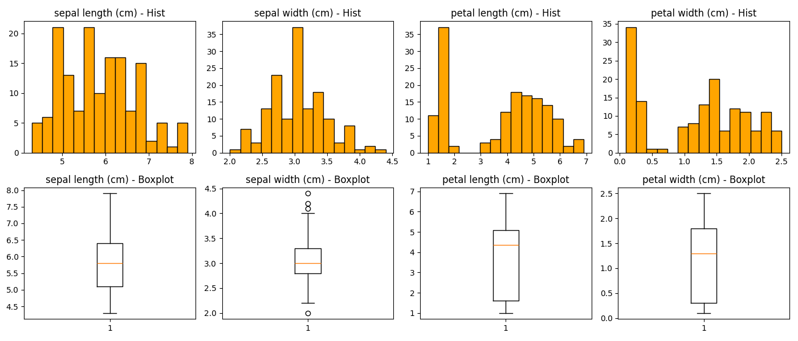
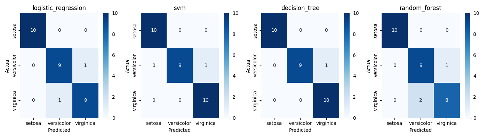

# Iris Classification API

End-to-end ML project: from EDA to REST API deployment with Docker. Classifies Iris flowers into three species based on sepal and petal measurements.

## Results

| Model | CV Accuracy | Std |
|-------|-------------|-----|
| **SVM** | **96.7%** | 3.1% |
| Logistic Regression | 95.8% | 2.6% |
| Random Forest | 95.0% | 1.7% |
| Decision Tree | 93.3% | 2.0% |

**Selected Model**: SVM (highest cross-validation accuracy with 5-fold CV)

## Dataset

[Iris Dataset](https://scikit-learn.org/stable/datasets/toy_dataset.html#iris-dataset) - 150 samples, 4 features, 3 balanced classes.

## Analysis & Visualizations

### Feature Distributions



**Key findings**:
- **Sepal length/width**: Gaussian distribution, sepal width shows 4 outliers
- **Petal length/width**: Bimodal distributions indicating natural separation between species
- Petal features show higher variance, suggesting strong predictive power

### Feature vs Target Correlation


**Separation analysis**:
- **Petal features** (length & width): Excellent separators - setosa completely isolated with no overlap
- **Sepal length**: Progressive increase across species with moderate overlap
- **Sepal width**: Setosa distinct, but versicolor/virginica overlap significantly

### Feature Correlation Matrix


**Correlation insights**:
- Petal length ↔ Petal width: Very high correlation (0.96) - redundant information
- Petal features ↔ Sepal length: Strong correlation (0.82-0.87)
- Sepal width: Weakly correlated with other features - provides complementary info

### Model Performance



**Test set results**:
- All models perfectly classify setosa (100% accuracy)
- SVM shows best overall performance with minimal misclassifications
- Decision Tree and Random Forest show similar confusion patterns

## Quick Start (Docker)
```bash
docker build -t iris-api .
docker run -p 8000:8000 iris-api
```

API available at `http://localhost:8000`

## Manual Installation
```bash
git clone https://github.com/YOUR_USERNAME/iris-classification.git
cd iris-classification
pip install -r requirements.txt
uvicorn app:app --reload
```

## API Endpoints

### GET /
Health check. Returns welcome message.

### POST /predict
Classifies an Iris flower.

**Request:**
```json
{
    "sepal_length": 5.1,
    "sepal_width": 3.5,
    "petal_length": 1.4,
    "petal_width": 0.2
}
```

**Response:**
```json
{
    "prediction": 0,
    "species": "setosa"
}
```

## Development Process

This project follows a standard ML workflow:

1. **Exploratory Data Analysis** (`iris_classification.ipynb`)
   - Dataset inspection (150 samples, 4 features, 3 balanced classes)
   - Feature distributions analysis (histograms, boxplots)
   - Target correlation study (boxplots by species)
   - Feature correlation matrix (identifying redundancies)

2. **Preprocessing**
   - Train/test split (80/20) with stratification
   - StandardScaler normalization (mean=0, std=1)
   - No missing values or class imbalance to handle

3. **Model Selection**
   - Tested 4 algorithms: Logistic Regression, SVM, Decision Tree, Random Forest
   - Evaluation via 5-fold cross-validation
   - SVM selected based on highest CV accuracy (96.7%)

4. **API Development** (`app.py`)
   - FastAPI REST endpoint for real-time predictions
   - Pydantic models for request/response validation
   - Model and scaler loaded from serialized files

5. **Deployment** (`Dockerfile`)
   - Docker containerization with Python 3.12-slim
   - Production-ready with Uvicorn server

## Project Structure
```
├── app.py                      # FastAPI application
├── Dockerfile                  # Container configuration (Python 3.12)
├── .dockerignore               # Excludes unnecessary files from build
├── iris_classification.ipynb   # Complete ML pipeline (EDA → modeling)
├── models/
│   ├── svm_v1.pkl              # Trained SVM classifier (96.7% CV accuracy)
│   └── std_scaler_v1.pkl       # Fitted StandardScaler
├── figures/
│   ├── iris_features_distribution.png    # Histograms & boxplots
│   ├── features_vs_target.png            # Species separation analysis
│   ├── correlation_matrix.png            # Feature correlation heatmap
│   └── confusion_matrices.png            # Model comparison
├── requirements.txt            # Python dependencies
├── .venv/                      # Virtual environment (local development)
└── README.md
```

## Tech Stack

**ML & Data Science**:

- Python 3.12
- scikit-learn 1.8.0 (SVM, preprocessing, metrics)
- pandas (data manipulation)
- numpy 2.4.0 (numerical operations)
- matplotlib & seaborn (visualizations)
- joblib (model serialization)

**API & Deployment**:

- FastAPI 0.127.0 (REST API framework)
- Pydantic 2.12.5 (data validation)
- Uvicorn 0.40.0 (ASGI server)
- Docker (containerization)

## Author

Fabio Grillo - [LinkedIn](https://linkedin.com/in/fabgrillo) | [GitHub](https://github.com/fabiogrillo)
