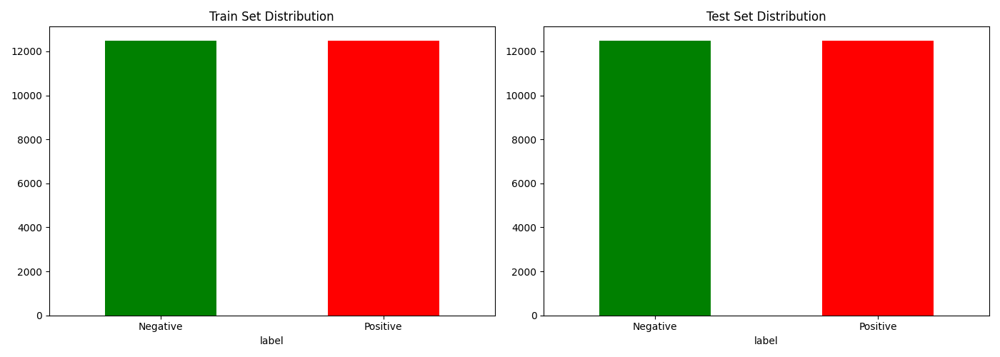
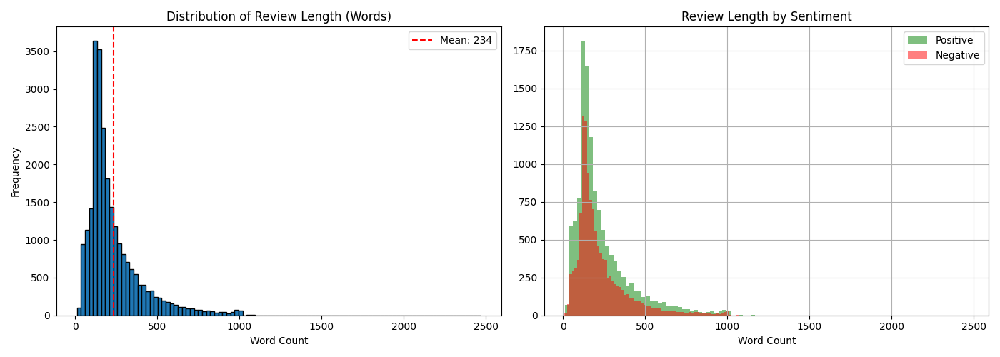
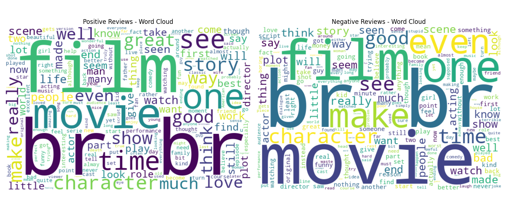
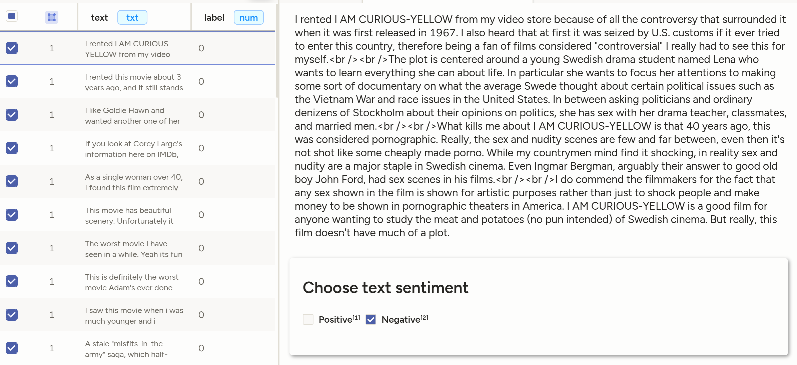
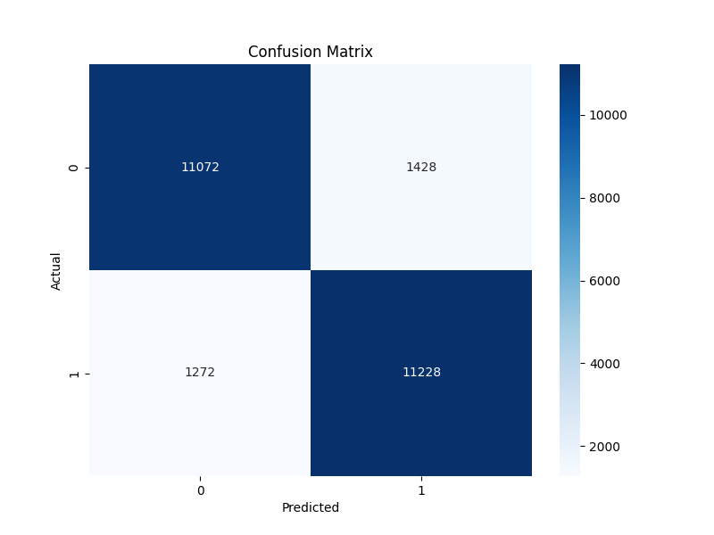
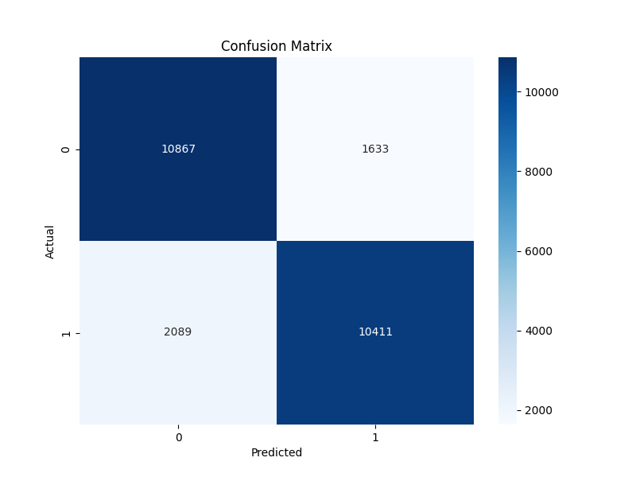

# Sentiment Analysis NLP

Production-ready sentiment classification system using Transformers with MLOps best practices.


## Project Overview

End-to-end sentiment analysis pipeline on IMDB movie reviews, demonstrating:

- **NLP expertise**: From classical baselines (TF-IDF) to Transformers (DistilBERT/RoBERTa)
- **MLOps maturity**: Experiment tracking, data versioning, reproducible pipelines
- **Production readiness**: FastAPI serving, Docker containerization
- **Industry tools**: Stack used at FAANG companies

## Dataset

**IMDB Movie Reviews** - 50,000 movie reviews for binary sentiment classification.

| Split | Samples | Positive | Negative |
|-------|---------|----------|----------|
| Train | 25,000 | 12,500 (50%) | 12,500 (50%) |
| Test | 25,000 | 12,500 (50%) | 12,500 (50%) |

### Class Distribution

The dataset is perfectly balanced, requiring no resampling techniques.



### Review Length Analysis

| Metric | Value |
|--------|-------|
| Mean words per review | ~234 |
| Max words | 2,470 |
| Min words | 10 |



### Word Cloud Analysis

Visual representation of most frequent words by sentiment:



## Tech Stack

| Category | Tools |
|----------|-------|
| Deep Learning | PyTorch, Hugging Face Transformers |
| NLP Models | DistilBERT, RoBERTa, TF-IDF + LogReg, LSTM |
| Experiment Tracking | MLflow |
| Data Versioning | DVC |
| Data Labeling | Label Studio |
| API Serving | FastAPI |
| Containerization | Docker, Docker Compose |

## Project Structure

```
Sentiment-Analysis-NLP/
├── data/
│   ├── raw/                 # Original dataset (DVC tracked)
│   ├── processed/           # Preprocessed data
│   └── labeled/             # Label Studio exports
├── notebooks/
│   └── eda.ipynb            # Exploratory Data Analysis
├── src/
│   ├── data/                # Data loading & preprocessing
│   ├── models/              # Model definitions
│   ├── training/            # Training utilities
│   └── inference/           # Prediction code
├── configs/                 # Training configurations
├── figures/                 # Visualizations
├── tests/                   # Unit tests
└── mlruns/                  # MLflow artifacts
```

## Getting Started

### Prerequisites

- Python 3.11+
- CUDA-compatible GPU (recommended)

### Installation

```bash
# Clone the repository
git clone https://github.com/yourusername/Sentiment-Analysis-NLP.git
cd Sentiment-Analysis-NLP

# Create virtual environment
python -m venv venv
source venv/bin/activate

# Install dependencies
pip install -r requirements.txt

# Pull data with DVC
dvc pull
```

### Running the Pipeline

```bash
# Run full pipeline
dvc repro

# View pipeline DAG
dvc dag
```

## Data Labeling Workflow

This project integrates Label Studio for professional annotation workflows, demonstrating understanding of real-world data labeling processes used in production ML systems.



## Model Results

### Baseline Models Comparison

| Model | Accuracy | F1 Score | Notes |
|-------|----------|----------|-------|
| **TF-IDF + Logistic Regression** | **89.2%** | **0.89** | Best baseline, fast training |
| Word2Vec + BiLSTM | 85.1% | 0.85 | GPU-accelerated, 20 epochs |

### Confusion Matrices

<table>
<tr>
<td><br/><center>TF-IDF + LogReg</center></td>
<td><br/><center>Word2Vec + BiLSTM</center></td>
</tr>
</table>

### Key Insights

- **TF-IDF outperforms LSTM** on this dataset due to effective n-gram capture and the limitation of training Word2Vec from scratch on only 25K samples
- **Bidirectional LSTM** improved from 67% to 85% after optimization (GPU, architecture tuning)
- **Transformer models** (next phase) are expected to surpass both baselines with pre-trained contextual embeddings

## Current Progress

### Week 1: Setup & EDA

- [x] Project structure setup
- [x] Virtual environment configuration
- [x] DVC initialization for data versioning
- [x] IMDB dataset download and exploration
- [x] Comprehensive EDA notebook with visualizations
- [x] Label Studio demo integration

### Week 2: Baseline Models

- [x] MLflow experiment tracking setup
- [x] TF-IDF + Logistic Regression baseline (89.2% accuracy)
- [x] Word2Vec + BiLSTM baseline (85.1% accuracy)
- [x] Model comparison and analysis

### Week 3: Transformers

- [ ] DistilBERT fine-tuning
- [ ] RoBERTa fine-tuning
- [ ] Hyperparameter tuning with Optuna

### Week 4: MLOps Pipeline

- [ ] Complete DVC pipeline
- [ ] MLflow Model Registry
- [ ] Reproducibility testing

### Week 5: Deployment

- [ ] FastAPI application
- [ ] Docker containerization
- [ ] Model explainability (SHAP)
